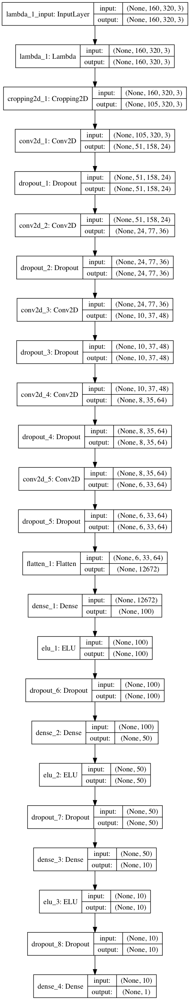
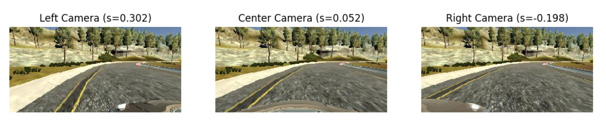
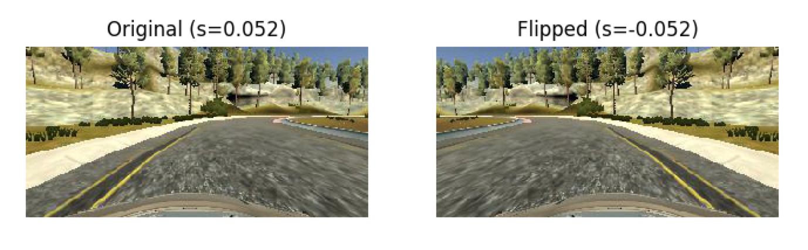
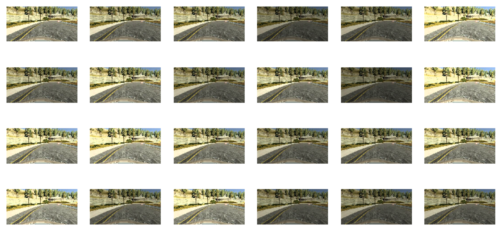
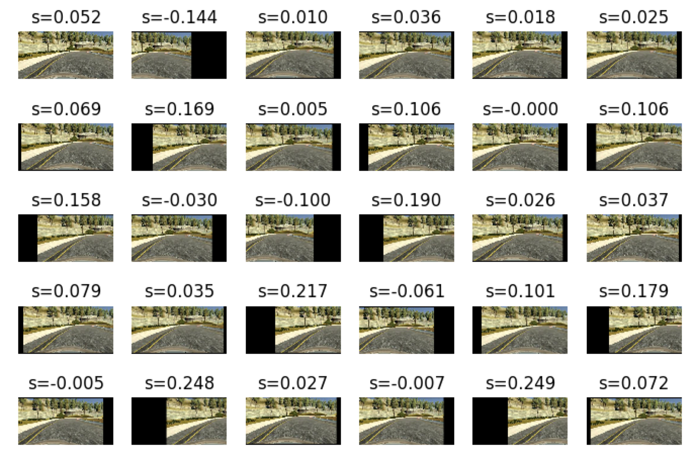
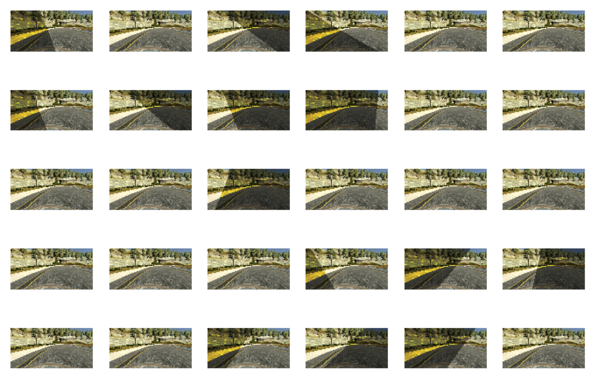
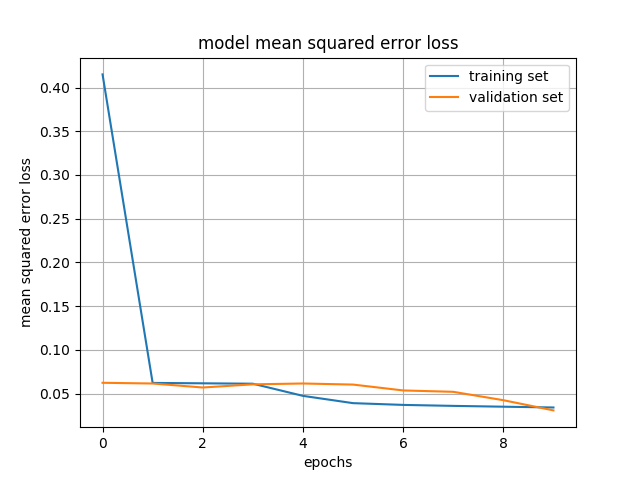

# **Behavioral Cloning** 

---
## Goal

The goals / steps of this project are the following:

* Use the simulator to collect data of good driving behavior
* Build, a convolution neural network in Keras that predicts steering angles from images
* Train and validate the model with a training and validation set
* Test that the model successfully drives around track one without leaving the road
* Summarize the results with a written report

---
## Refelction
Here I will consider the [rubric points](https://review.udacity.com/#!/rubrics/432/view) individually and describe how I addressed each point in my implementation. 

### Files Submitted & Code Quality

#### 1. Submission includes all required files and can be used to run the simulator in autonomous mode

My project includes the following files:

* **model.py** and **funcs.py** containing the script to load data, create and train the model
* **drive.py** for driving the car in autonomous mode
* **model.h5** containing a trained convolution neural network 
* **video.mp4** the final output video for track 1
* **README.md** summarizing the results

#### 2. Submission includes functional code
Using the Udacity provided simulator and my ```drive.py``` file, the car can be driven autonomously around the track by executing 
```python drive.py model.h5```

#### 3. Submission code is usable and readable

The ```model.py``` and ```func.py``` file contains the code for training and saving the convolution neural network. The file shows the pipeline I used for training and validating the model, and it contains comments to explain how the code works and the references that have been used.

### Model Architecture and Training Strategy

#### 1. An appropriate model architecture has been employed

My model consists of a convolution neural network with 3@5x5 and 2@3x3 convolution layers then 4 FC (fully connected) layers, and 8 dropout(0.5) layers after each, except for the last FC layer. The code is ```model.py``` [line 52 ~ 87](model.py#L52-L87) 

The model includes ELU layers to introduce nonlinearity after each FC layer (except for the last one). And the data is normalized in the model using a Keras lambda layer, and after lambda layer, there is a cropping layer to crop the top 30 rows of the image to remove the sky and the bottom 25 rows to remove the hood of the car. 

```
model.add(Lambda(lambda x:(x/255.0)-0.5,input_shape=(160,320,3)))
model.add(Cropping2D(cropping= ((30,25),(0,0))))
```

The model summary is as follows:

```
Layer (type)                     Output Shape          Param #     Connected to
====================================================================================================
lambda_1 (Lambda)                (None, 160, 320, 3)   0           lambda_input_1[0][0]
____________________________________________________________________________________________________
cropping2d_1 (Cropping2D)        (None, 105, 320, 3)   0           lambda_1[0][0]
____________________________________________________________________________________________________
convolution2d_1 (Convolution2D)  (None, 51, 158, 24)   1824        cropping2d_1[0][0]
____________________________________________________________________________________________________
dropout_1 (Dropout)              (None, 51, 158, 24)   0           convolution2d_1[0][0]
____________________________________________________________________________________________________
convolution2d_2 (Convolution2D)  (None, 24, 77, 36)    21636       dropout_1[0][0]
____________________________________________________________________________________________________
dropout_2 (Dropout)              (None, 24, 77, 36)    0           convolution2d_2[0][0]
____________________________________________________________________________________________________
convolution2d_3 (Convolution2D)  (None, 10, 37, 48)    43248       dropout_2[0][0]
____________________________________________________________________________________________________
dropout_3 (Dropout)              (None, 10, 37, 48)    0           convolution2d_3[0][0]
____________________________________________________________________________________________________
convolution2d_4 (Convolution2D)  (None, 8, 35, 64)     27712       dropout_3[0][0]
____________________________________________________________________________________________________
dropout_4 (Dropout)              (None, 8, 35, 64)     0           convolution2d_4[0][0]
____________________________________________________________________________________________________
convolution2d_5 (Convolution2D)  (None, 6, 33, 64)     36928       dropout_4[0][0]
____________________________________________________________________________________________________
dropout_5 (Dropout)              (None, 6, 33, 64)     0           convolution2d_5[0][0]
____________________________________________________________________________________________________
flatten_1 (Flatten)              (None, 12672)         0           dropout_5[0][0]
____________________________________________________________________________________________________
dense_1 (Dense)                  (None, 100)           1267300     flatten_1[0][0]
____________________________________________________________________________________________________
elu_1 (ELU)                      (None, 100)           0           dense_1[0][0]
____________________________________________________________________________________________________
dropout_6 (Dropout)              (None, 100)           0           elu_1[0][0]
____________________________________________________________________________________________________
dense_2 (Dense)                  (None, 50)            5050        dropout_6[0][0]
____________________________________________________________________________________________________
elu_2 (ELU)                      (None, 50)            0           dense_2[0][0]
____________________________________________________________________________________________________
dropout_7 (Dropout)              (None, 50)            0           elu_2[0][0]
____________________________________________________________________________________________________
dense_3 (Dense)                  (None, 10)            510         dropout_7[0][0]
____________________________________________________________________________________________________
elu_3 (ELU)                      (None, 10)            0           dense_3[0][0]
____________________________________________________________________________________________________
dropout_8 (Dropout)              (None, 10)            0           elu_3[0][0]
____________________________________________________________________________________________________
dense_4 (Dense)                  (None, 1)             11          dropout_8[0][0]
====================================================================================================
Total params: 1,404,219
Trainable params: 1,404,219
Non-trainable params: 0
```

#### 2. Attempts to reduce overfitting in the model

The model contains **8 dropout layers** in order to reduce overfitting (model.py lines 21). 

I split the dataset into training and validation (with ratio = 0.2). The data was shuffled randomly, and the validation loss was calculated at end of each epoch, to check if it was increasing.

The model is only trained with the data provided by Udacity, but I have applied several augmentation techniques (add random brightness, shifting and shadow) to make the model as general as possible. It is inspired by this great [post](https://chatbotslife.com/using-augmentation-to-mimic-human-driving-496b569760a9).

The model was tested by running it through the simulator and ensuring that the vehicle could stay on the track 1.

#### 3. Model parameter tuning

The model used an adam optimizer, so the learning rate was not tuned manually. [The Code](model.py#L25).

#### 4. Appropriate training data

Training data was chosen to keep the vehicle driving on the road. I used a combination of center lane driving (center camera), recovering from the left and right sides of the road (left and right camera), and I also used several image augmentation techniques to simulate the effect of shadows on the road, darker environment and up and down the slope. 

For details about how I created the training data, see the next section. 

### Model Architecture and Training Strategy

#### 1. Solution Design Approach

The overall strategy for deriving a model architecture was to combat the overfitting - generalize the model.

I only used the data provided by Udacity.

My first try is to use [LeNet5](http://yann.lecun.com/exdb/lenet/) , it is very hard to keep the car inside of the road with 8 epochs of training. It drove off the road directly, then I do some pre-processing (with keras lambda layer), but it still failed at the first turn.

Then I decided to use [nVidia's driving model](https://devblogs.nvidia.com/parallelforall/deep-learning-self-driving-cars/), and also I flipped the image horizontally with a negative angle to generate new training data. And also, the left and right camera images are introduced as recovery data with correction factor on the steering angles. It worked much better, I only feed the model with about half of the training data, it can drive through track one, but it drives terribly (it kept driving 'zigzag' on the road).

In order to gauge how well the model was working, I split my image and steering angle data into a training and validation set. I found that the model had a low mean squared error on the training set but a high mean squared error on the validation set. This implied that the model was overfitting. 

To combat the overfitting, I added 8 dropout layers after each convolution layer and FC layer. And I applied more augmentation techniques: add random brightness, shift horizontally and/or vertically, add random shadow to generate more data for model to learn. Then the model is able to drive much better around the track without leaving the road.

However I haven't succeed to let model drive through track 2 (with no training data from track 2). According to [this post](https://discussions.udacity.com/t/is-it-posible-to-generalize-to-track-2-from-track-1/239877), it could be very difficult.

#### 2. Final Model Architecture

The final model architecture is shown as follows:



#### 3. Creation of the Training Set & Training Process

I only used the training data provided by Udacity. Inspired by the great [post](https://chatbotslife.com/using-augmentation-to-mimic-human-driving-496b569760a9), I applied several data augmentation techniques.

##### 1. Left and Right camera images

Left and right camera images are introduced with correction facotr (=0.25) on steering angle to simulate the recovery data.



##### 2. Flipping

I flipped images horizontally to simulate driving in the opposite direction. The original data set had much more left turns than right turns, the flipping could balance it off, the corresponding steering angle ```= -1.0 * angle```. 



##### 3. Random Brightness

I scaled the image's brightness so that the model can learn to drive in both bright and dark conditions. To do brightness augmentation, I converted RGB image to HSV, scaled V (brightness) channel by a random number, and converted the image back to RGB.



##### 4. Shifting

I shift the images horizontally to simulate the effect of recovery, and apply correction factor on steering angle. I also shift the images vertically by a random number to simulate the effect of driving up or down the slope.



##### 5. Random Shadow

I add random shadows across the image to simulate shadows casting on the road.




All these data was used for training the model with 10 epochs, and the data set was shuffled randomly before each epoch. The training is as follows:




After training, the model could drive through track 1, the output video is [here](video.mp4).
